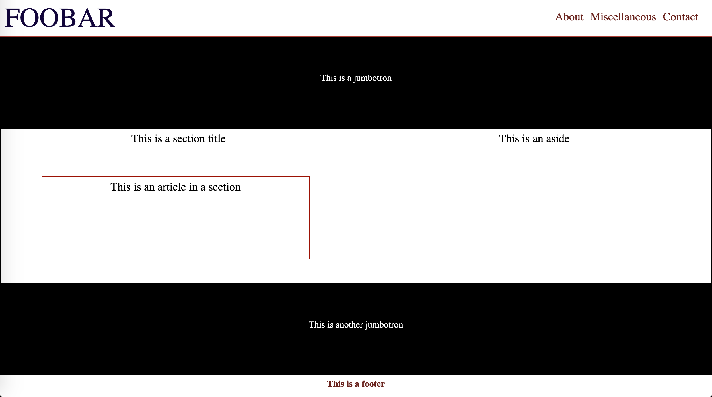

# css_practice_repo
A repo that will contain practice and new tricks I learned
## What is my goal/purpose for creating this repo?
I will be practicing styles I know and learning new ones along the way, which will help me in my future projects
## Side
Further down the pratice, I will be incorporating more html files to practice bootstrap and style tricks together

### Exercise 1: HTML and CSS
Basic set up. I went for as simple as possible. Here's what it looks like:

### Exercise 2: Making Exercise 1 Mobile Responsive (Attempt 1)
Here, I am using Exercise 1's code and using media queries to try and make it mobile responsive. There's definitely a lot more I can add to the queries, but here is what it looks like after some basic additions (this is after the 9th commit).

### Exercise 2: Making Exercise 1 Mobile Responsive (Attempt 2)
Additional styles given to tags, classes, and ids. The float: left style seemed to help out a lot! figure out why; put explanation here.
